# pow3r.cashout - Comprehensive Architecture Diagram

## Current System Architecture (with % Completion Status)

```mermaid
graph TB
    %% Frontend Layer
    subgraph "Frontend Layer (100% Complete)"
        A[React SPA Dashboard] --> B[Component Library]
        A --> C[Theme System]
        A --> D[Responsive Design]
        B --> E[Metadata System]
        C --> F[Dark Mode]
        D --> G[Mobile-First]
    end

    %% Core Components
    subgraph "Core Components (100% Complete)"
        H[DashboardCard] --> I[PriceChart]
        H --> J[LeadsChart]
        H --> K[StatsWidget]
        H --> L[ListingsWidget]
        M[AuthProvider] --> N[ThemeProvider]
    end

    %% State Management
    subgraph "State Management (100% Complete)"
        O[Zustand Store] --> P[React Query]
        O --> Q[SWR Cache]
        P --> R[API Client]
    end

    %% Build System
    subgraph "Build System (100% Complete)"
        S[Vite] --> T[TypeScript]
        S --> U[Tailwind CSS]
        S --> V[PostCSS]
        T --> W[ESLint]
    end

    %% Testing
    subgraph "Testing (100% Complete)"
        X[Playwright E2E] --> Y[Visual Regression]
        X --> Z[Component Tests]
        Y --> AA[Responsive Tests]
    end

    %% Deployment
    subgraph "Deployment (100% Complete)"
        BB[Cloudflare Pages] --> CC[CDN]
        BB --> DD[SSL Certificate]
        CC --> EE[Global Distribution]
    end

    %% API Layer (0% Complete - Not Implemented)
    subgraph "API Layer (0% Complete)"
        FF[Cloudflare Functions] -.-> GG[Auth API]
        FF -.-> HH[Listings API]
        FF -.-> II[Leads API]
        FF -.-> JJ[Analytics API]
    end

    %% Database Layer (0% Complete - Not Implemented)
    subgraph "Database Layer (0% Complete)"
        KK[Prisma ORM] -.-> LL[PostgreSQL]
        KK -.-> MM[Redis Cache]
        LL -.-> NN[User Data]
        LL -.-> OO[Listings Data]
        LL -.-> PP[Analytics Data]
    end

    %% External Integrations (0% Complete - Not Implemented)
    subgraph "External Integrations (0% Complete)"
        QQ[Facebook API] -.-> RR[Marketplace]
        SS[OfferUp API] -.-> TT[Listings]
        UU[Craigslist API] -.-> VV[Posting]
        WW[Email Service] -.-> XX[Notifications]
    end

    %% Automation Layer (0% Complete - Not Implemented)
    subgraph "Automation Layer (0% Complete)"
        YY[Auto-Responder] -.-> ZZ[Message Templates]
        AAA[Cross-Posting] -.-> BBB[Platform Sync]
        CCC[Lead Scoring] -.-> DDD[Priority Queue]
        EEE[Analytics Engine] -.-> FFF[Performance Tracking]
    end

    %% Connections
    A --> H
    A --> M
    H --> O
    O --> S
    S --> X
    X --> BB
    
    %% Future connections (dotted lines)
    A -.-> FF
    FF -.-> KK
    KK -.-> QQ
    QQ -.-> YY

    %% Styling
    classDef completed fill:#22c55e,stroke:#16a34a,stroke-width:3px,color:#fff
    classDef notImplemented fill:#ef4444,stroke:#dc2626,stroke-width:2px,color:#fff
    classDef partial fill:#f59e0b,stroke:#d97706,stroke-width:2px,color:#fff

    class A,B,C,D,E,F,G,H,I,J,K,L,M,N,O,P,Q,R,S,T,U,V,W,X,Y,Z,AA,BB,CC,DD,EE completed
    class FF,GG,HH,II,JJ,KK,LL,MM,NN,OO,PP,QQ,RR,SS,TT,UU,VV,WW,XX,YY,ZZ,AAA,BBB,CCC,DDD,EEE,FFF notImplemented
```

## Architecture Summary

### ✅ Completed Components (100%)
- **Frontend**: React SPA with dashboard, component library, theme system
- **Core Components**: DashboardCard, charts, widgets with metadata
- **State Management**: Zustand, React Query, SWR
- **Build System**: Vite, TypeScript, Tailwind CSS, PostCSS
- **Testing**: Playwright E2E tests with visual regression
- **Deployment**: Cloudflare Pages with CDN and SSL

### ❌ Not Implemented (0%)
- **API Layer**: Cloudflare Functions for backend services
- **Database Layer**: Prisma ORM with PostgreSQL/Redis
- **External Integrations**: Facebook, OfferUp, Craigslist APIs
- **Automation Layer**: Auto-responder, cross-posting, lead scoring

### 📊 Overall Completion: 40%
- Frontend: 100% Complete
- Backend: 0% Complete
- Integrations: 0% Complete
- Automation: 0% Complete
