# pow3r.cashout - Ideal System Architecture & User Flow

## Complete Multi-Platform Selling Automation System

```mermaid
graph TB
    %% User Interface Layer
    subgraph "🎨 User Interface Layer"
        A[React SPA Dashboard] --> B[Component Library]
        A --> C[Theme System]
        A --> D[Mobile App]
        B --> E[Metadata System]
        C --> F[Dark/Light Mode]
        D --> G[Push Notifications]
    end

    %% Core Business Logic
    subgraph "🧠 Core Business Logic"
        H[Item Management] --> I[Photo Processing]
        H --> J[Price Optimization]
        H --> K[Content Generation]
        L[Lead Management] --> M[Auto-Response]
        L --> N[Lead Scoring]
        L --> O[Negotiation Engine]
        P[Analytics Engine] --> Q[Performance Tracking]
        P --> R[Revenue Optimization]
        P --> S[Market Analysis]
    end

    %% Automation Layer
    subgraph "🤖 Automation Layer"
        T[Cross-Platform Engine] --> U[Facebook Integration]
        T --> V[OfferUp Integration]
        T --> W[Craigslist Integration]
        T --> X[Other Platforms]
        Y[AI Content Generator] --> Z[Platform-Specific Content]
        Y --> AA[SEO Optimization]
        Y --> BB[Image Enhancement]
        CC[Smart Scheduling] --> DD[Optimal Posting Times]
        CC --> EE[Lead Follow-up]
        CC --> FF[Price Adjustments]
    end

    %% External Platform Integrations
    subgraph "🌐 External Platform Integrations"
        GG[Facebook Marketplace API] --> HH[Posting & Monitoring]
        II[OfferUp API] --> JJ[Listing Management]
        KK[Craigslist API] --> LL[Automated Posting]
        MM[Email Services] --> NN[Notifications]
        OO[Payment Gateways] --> PP[Transaction Processing]
        QQ[Shipping APIs] --> RR[Logistics Management]
    end

    %% Data Layer
    subgraph "💾 Data Layer"
        SS[PostgreSQL Database] --> TT[User Data]
        SS --> UU[Listing Data]
        SS --> VV[Analytics Data]
        WW[Redis Cache] --> XX[Session Management]
        WW --> YY[Real-time Data]
        ZZ[File Storage] --> AAA[Images & Documents]
        ZZ --> BBB[Backup & Recovery]
    end

    %% AI & Machine Learning
    subgraph "🤖 AI & Machine Learning"
        CCC[Price Optimization AI] --> DDD[Market Analysis]
        CCC --> EEE[Competitor Tracking]
        FFF[Lead Scoring AI] --> GGG[Behavior Analysis]
        FFF --> HHH[Conversion Prediction]
        III[Content AI] --> JJJ[Auto-Generated Descriptions]
        III --> KKK[Image Recognition]
        LLL[Chatbot AI] --> MMM[Natural Language Processing]
        LLL --> NNN[Sentiment Analysis]
    end

    %% Security & Compliance
    subgraph "🔒 Security & Compliance"
        OOO[Authentication] --> PPP[Multi-Factor Auth]
        OOO --> QQQ[OAuth Integration]
        RRR[Data Encryption] --> SSS[At Rest & In Transit]
        TTT[GDPR Compliance] --> UUU[Data Privacy]
        VVV[Rate Limiting] --> WWW[API Protection]
    end

    %% Monitoring & Analytics
    subgraph "📊 Monitoring & Analytics"
        XXX[Real-time Monitoring] --> YYY[System Health]
        XXX --> ZZZ[Performance Metrics]
        AAA[Business Intelligence] --> BBB[Revenue Analytics]
        AAA --> CCC[User Behavior]
        DDD[Alerting System] --> EEE[Error Notifications]
        DDD --> FFF[Performance Alerts]
    end

    %% User Journey Flow
    subgraph "👤 User Journey Flow"
        GGG[User Onboarding] --> HHH[Item Setup]
        HHH --> III[Photo Upload]
        III --> JJJ[AI Content Generation]
        JJJ --> KKK[Platform Selection]
        KKK --> LLL[Automated Posting]
        LLL --> MMM[Lead Management]
        MMM --> NNN[Auto-Response]
        NNN --> OOO[Negotiation Support]
        OOO --> PPP[Sale Completion]
        PPP --> QQQ[Analytics Update]
    end

    %% Phase 1: Content & Setup (Blue)
    subgraph "🔵 Phase 1: Content & Setup"
        RRR[Item Details] --> SSS[Photo Processing]
        SSS --> TTT[Price Research]
        TTT --> UUU[Content Generation]
        UUU --> VVV[Platform Selection]
        VVV --> WWW[Posting Strategy]
    end

    %% Phase 2: Automation & Management (Green)
    subgraph "🟢 Phase 2: Automation & Management"
        XXX[Auto-Posting] --> YYY[Lead Monitoring]
        YYY --> ZZZ[Auto-Response]
        ZZZ --> AAAA[Negotiation Management]
        AAAA --> BBBB[Sale Processing]
        BBBB --> CCCC[Analytics Tracking]
    end

    %% Connections
    A --> H
    H --> T
    T --> GG
    GG --> SS
    SS --> CCC
    
    %% User Journey Connections
    GGG --> HHH
    HHH --> RRR
    RRR --> XXX
    
    %% Phase Connections
    RRR -.->|Phase 1| SSS
    SSS -.->|Phase 1| TTT
    TTT -.->|Phase 1| UUU
    UUU -.->|Phase 1| VVV
    VVV -.->|Phase 1| WWW
    
    WWW -.->|Phase 2| XXX
    XXX -.->|Phase 2| YYY
    YYY -.->|Phase 2| ZZZ
    ZZZ -.->|Phase 2| AAAA
    AAAA -.->|Phase 2| BBBB
    BBBB -.->|Phase 2| CCCC

    %% Styling
    classDef userInterface fill:#3b82f6,stroke:#1d4ed8,stroke-width:3px,color:#fff
    classDef businessLogic fill:#10b981,stroke:#059669,stroke-width:2px,color:#fff
    classDef automation fill:#f59e0b,stroke:#d97706,stroke-width:2px,color:#fff
    classDef external fill:#8b5cf6,stroke:#7c3aed,stroke-width:2px,color:#fff
    classDef data fill:#06b6d4,stroke:#0891b2,stroke-width:2px,color:#fff
    classDef ai fill:#ec4899,stroke:#db2777,stroke-width:2px,color:#fff
    classDef security fill:#ef4444,stroke:#dc2626,stroke-width:2px,color:#fff
    classDef monitoring fill:#84cc16,stroke:#65a30d,stroke-width:2px,color:#fff
    classDef phase1 fill:#3b82f6,stroke:#1d4ed8,stroke-width:4px,color:#fff
    classDef phase2 fill:#10b981,stroke:#059669,stroke-width:4px,color:#fff

    class A,B,C,D,E,F,G userInterface
    class H,I,J,K,L,M,N,O,P,Q,R,S businessLogic
    class T,U,V,W,X,Y,Z,AA,BB,CC,DD,EE,FF automation
    class GG,HH,II,JJ,KK,LL,MM,NN,OO,PP,QQ,RR external
    class SS,TT,UU,VV,WW,XX,YY,ZZ,AAA,BBB data
    class CCC,DDD,EEE,FFF,GGG,HHH,III,JJJ,KKK,LLL,MMM,NNN ai
    class OOO,PPP,QQQ,RRR,SSS,TTT,UUU,VVV,WWW security
    class XXX,YYY,ZZZ,AAA,BBB,CCC,DDD,EEE,FFF monitoring
    class RRR,SSS,TTT,UUU,VVV,WWW phase1
    class XXX,YYY,ZZZ,AAAA,BBBB,CCCC phase2
```

## System Capabilities

### 🎯 Core Features
- **Multi-Platform Selling**: Facebook, OfferUp, Craigslist, and more
- **AI-Powered Content**: Auto-generated descriptions and optimized images
- **Smart Pricing**: Dynamic pricing based on market analysis
- **Lead Management**: Automated response and lead scoring
- **Analytics Dashboard**: Real-time performance tracking

### 🤖 Automation Features
- **Cross-Platform Posting**: Simultaneous posting to multiple platforms
- **Auto-Response System**: Intelligent message handling
- **Lead Scoring**: AI-powered lead prioritization
- **Price Optimization**: Dynamic pricing adjustments
- **Content Generation**: Platform-specific content creation

### 📊 Analytics & Intelligence
- **Performance Tracking**: Real-time metrics and KPIs
- **Revenue Analytics**: Profit tracking and optimization
- **Market Analysis**: Competitor monitoring and trends
- **User Behavior**: Insights for better decision making
- **Predictive Analytics**: Sales forecasting and optimization

### 🔒 Security & Compliance
- **Multi-Factor Authentication**: Secure user access
- **Data Encryption**: End-to-end data protection
- **GDPR Compliance**: Privacy and data protection
- **API Security**: Rate limiting and protection
- **Audit Logging**: Complete activity tracking

## Phase Implementation

### 🔵 Phase 1: Content & Setup (Blue)
1. **Item Details**: Comprehensive product information
2. **Photo Processing**: AI-enhanced image optimization
3. **Price Research**: Market analysis and competitive pricing
4. **Content Generation**: Platform-specific descriptions
5. **Platform Selection**: Multi-platform strategy
6. **Posting Strategy**: Optimal timing and frequency

### 🟢 Phase 2: Automation & Management (Green)
1. **Auto-Posting**: Scheduled and triggered posting
2. **Lead Monitoring**: Real-time message tracking
3. **Auto-Response**: Intelligent conversation management
4. **Negotiation Management**: Price and meetup coordination
5. **Sale Processing**: Payment and transaction handling
6. **Analytics Tracking**: Performance and revenue monitoring

## Technology Stack

### Frontend
- **React SPA**: Modern, responsive dashboard
- **TypeScript**: Type-safe development
- **Tailwind CSS**: Utility-first styling
- **Zustand**: Lightweight state management
- **React Query**: Server state management

### Backend
- **Cloudflare Functions**: Serverless API
- **PostgreSQL**: Primary database
- **Redis**: Caching and sessions
- **Prisma**: Database ORM

### AI & ML
- **OpenAI API**: Content generation
- **Custom ML Models**: Lead scoring and pricing
- **Image Processing**: Photo enhancement
- **NLP**: Natural language understanding

### Integrations
- **Facebook Graph API**: Marketplace integration
- **OfferUp API**: Listing management
- **Craigslist API**: Automated posting
- **Email Services**: Notification delivery
- **Payment Gateways**: Transaction processing

## Scalability & Performance

### Horizontal Scaling
- **Microservices**: Modular architecture
- **Load Balancing**: Traffic distribution
- **CDN**: Global content delivery
- **Caching**: Multi-layer caching strategy

### Performance Optimization
- **Lazy Loading**: On-demand resource loading
- **Code Splitting**: Optimized bundle sizes
- **Image Optimization**: Compressed and responsive images
- **Database Indexing**: Optimized queries

### Monitoring & Alerting
- **Real-time Monitoring**: System health tracking
- **Performance Metrics**: Response time monitoring
- **Error Tracking**: Automated error detection
- **Business Intelligence**: Revenue and user analytics
