# pow3r.cashout - Phase Mapping Diagram

## Phase 1 vs Phase 2 Implementation Strategy

```mermaid
graph TB
    %% Phase 1: Content & Setup (Blue)
    subgraph "🔵 PHASE 1: CONTENT & SETUP (Blue)"
        A1[Item Details Collection] --> A2[Photo Upload & Processing]
        A2 --> A3[Price Research & Analysis]
        A3 --> A4[Content Generation]
        A4 --> A5[Platform Selection]
        A5 --> A6[Posting Strategy]
        
        %% Phase 1 Sub-components
        A1 --> A1A[Product Information]
        A1 --> A1B[Category Selection]
        A1 --> A1C[Condition Assessment]
        
        A2 --> A2A[Image Enhancement]
        A2 --> A2B[Background Removal]
        A2 --> A2C[Multiple Angles]
        A2 --> A2D[Thumbnail Generation]
        
        A3 --> A3A[Market Research]
        A3 --> A3B[Competitor Analysis]
        A3 --> A3C[Price Optimization]
        A3 --> A3D[Profit Margin Calculation]
        
        A4 --> A4A[Title Generation]
        A4 --> A4B[Description Writing]
        A4 --> A4C[SEO Optimization]
        A4 --> A4D[Platform-Specific Content]
        
        A5 --> A5A[Facebook Marketplace]
        A5 --> A5B[OfferUp]
        A5 --> A5C[Craigslist]
        A5 --> A5D[Other Platforms]
        
        A6 --> A6A[Posting Schedule]
        A6 --> A6B[Content Variations]
        A6 --> A6C[Timing Optimization]
        A6 --> A6D[Frequency Planning]
    end

    %% Phase 2: Automation & Management (Green)
    subgraph "🟢 PHASE 2: AUTOMATION & MANAGEMENT (Green)"
        B1[Auto-Posting Engine] --> B2[Lead Monitoring System]
        B2 --> B3[Auto-Response System]
        B3 --> B4[Negotiation Management]
        B4 --> B5[Sale Processing]
        B5 --> B6[Analytics & Reporting]
        
        %% Phase 2 Sub-components
        B1 --> B1A[Cross-Platform Posting]
        B1 --> B1B[Schedule Management]
        B1 --> B1C[Content Rotation]
        B1 --> B1D[Performance Tracking]
        
        B2 --> B2A[Message Monitoring]
        B2 --> B2B[Lead Scoring]
        B2 --> B2C[Priority Queue]
        B2 --> B2D[Notification System]
        
        B3 --> B3A[Template Management]
        B3 --> B3B[Response Logic]
        B3 --> B3C[Lead Qualification]
        B3 --> B3D[Escalation Rules]
        
        B4 --> B4A[Price Negotiation]
        B4 --> B4B[Meetup Scheduling]
        B4 --> B4C[Payment Coordination]
        B4 --> B4D[Documentation]
        
        B5 --> B5A[Transaction Processing]
        B5 --> B5B[Payment Verification]
        B5 --> B5C[Delivery Coordination]
        B5 --> B5D[Receipt Generation]
        
        B6 --> B6A[Performance Metrics]
        B6 --> B6B[Revenue Tracking]
        B6 --> B6C[Lead Analytics]
        B6 --> B6D[Optimization Suggestions]
    end

    %% Content Strategy Components (Phase 1)
    subgraph "📝 CONTENT STRATEGY (Phase 1)"
        C1[Pricing Strategy] --> C2[Photo Strategy]
        C2 --> C3[Content Strategy]
        C3 --> C4[Platform Strategy]
        C4 --> C5[Messaging Strategy]
        
        C1 --> C1A[Market Research]
        C1 --> C1B[Competitive Analysis]
        C1 --> C1C[Profit Optimization]
        C1 --> C1D[Price Testing]
        
        C2 --> C2A[Professional Photography]
        C2 --> C2B[Multiple Angles]
        C2 --> C2C[Lighting Optimization]
        C2 --> C2D[Background Cleanup]
        
        C3 --> C3A[SEO-Optimized Titles]
        C3 --> C3B[Compelling Descriptions]
        C3 --> C3C[Keyword Integration]
        C3 --> C3D[Call-to-Action]
        
        C4 --> C4A[Platform-Specific Formatting]
        C4 --> C4B[Audience Targeting]
        C4 --> C4C[Posting Schedule]
        C4 --> C4D[Cross-Platform Sync]
        
        C5 --> C5A[Response Templates]
        C5 --> C5B[Lead Qualification]
        C5 --> C5C[Negotiation Scripts]
        C5 --> C5D[Follow-up Sequences]
    end

    %% Automation Components (Phase 2)
    subgraph "🤖 AUTOMATION COMPONENTS (Phase 2)"
        D1[Posting Automation] --> D2[Response Automation]
        D2 --> D3[Management Automation]
        D3 --> D4[Analytics Automation]
        
        D1 --> D1A[Scheduled Posting]
        D1 --> D1B[Content Rotation]
        D1 --> D1C[Performance Monitoring]
        D1 --> D1D[Auto-Reposting]
        
        D2 --> D2A[Auto-Response Templates]
        D2 --> D2B[Lead Qualification]
        D2 --> D2C[Escalation Rules]
        D2 --> D2D[Follow-up Automation]
        
        D3 --> D3A[Lead Management]
        D3 --> D3B[Negotiation Support]
        D3 --> D3C[Sale Processing]
        D3 --> D3D[Customer Service]
        
        D4 --> D4A[Performance Tracking]
        D4 --> D4B[Revenue Analytics]
        D4 --> D4C[Lead Analytics]
        D4 --> D4D[Optimization Alerts]
    end

    %% Phase 1 to Phase 2 Transition
    A6 -->|Transition| B1
    C5 -->|Transition| D1
    
    %% Cross-Phase Connections
    A4 -.->|Content Input| B1
    A3 -.->|Pricing Input| B4
    A2 -.->|Photo Assets| B1
    A5 -.->|Platform Config| B1
    
    %% Styling
    classDef phase1 fill:#3b82f6,stroke:#1d4ed8,stroke-width:4px,color:#fff
    classDef phase2 fill:#10b981,stroke:#059669,stroke-width:4px,color:#fff
    classDef content fill:#8b5cf6,stroke:#7c3aed,stroke-width:3px,color:#fff
    classDef automation fill:#f59e0b,stroke:#d97706,stroke-width:3px,color:#fff
    classDef transition fill:#ef4444,stroke:#dc2626,stroke-width:3px,color:#fff

    class A1,A2,A3,A4,A5,A6,A1A,A1B,A1C,A2A,A2B,A2C,A2D,A3A,A3B,A3C,A3D,A4A,A4B,A4C,A4D,A5A,A5B,A5C,A5D,A6A,A6B,A6C,A6D phase1
    class B1,B2,B3,B4,B5,B6,B1A,B1B,B1C,B1D,B2A,B2B,B2C,B2D,B3A,B3B,B3C,B3D,B4A,B4B,B4C,B4D,B5A,B5B,B5C,B5D,B6A,B6B,B6C,B6D phase2
    class C1,C2,C3,C4,C5,C1A,C1B,C1C,C1D,C2A,C2B,C2C,C2D,C3A,C3B,C3C,C3D,C4A,C4B,C4C,C4D,C5A,C5B,C5C,C5D content
    class D1,D2,D3,D4,D1A,D1B,D1C,D1D,D2A,D2B,D2C,D2D,D3A,D3B,D3C,D3D,D4A,D4B,D4C,D4D automation
```

## Phase 1: Content & Setup (Blue) - 0% Complete

### 🎯 Objectives
- **Item Preparation**: Complete product setup and optimization
- **Content Creation**: Generate platform-specific content
- **Strategy Development**: Develop comprehensive selling strategy
- **Platform Configuration**: Set up multi-platform presence

### 📋 Phase 1 Tasks

#### 1. Item Details Collection
- [ ] Product information form
- [ ] Category selection system
- [ ] Condition assessment tool
- [ ] Custom attributes support

#### 2. Photo Upload & Processing
- [ ] Multi-image upload system
- [ ] AI-powered image enhancement
- [ ] Background removal tool
- [ ] Thumbnail generation
- [ ] Image optimization for platforms

#### 3. Price Research & Analysis
- [ ] Market research integration
- [ ] Competitor price tracking
- [ ] Price optimization algorithms
- [ ] Profit margin calculator
- [ ] Dynamic pricing suggestions

#### 4. Content Generation
- [ ] AI-powered title generation
- [ ] Description writing assistant
- [ ] SEO optimization tools
- [ ] Platform-specific formatting
- [ ] Keyword research integration

#### 5. Platform Selection
- [ ] Facebook Marketplace integration
- [ ] OfferUp API connection
- [ ] Craigslist posting system
- [ ] Additional platform support
- [ ] Cross-platform synchronization

#### 6. Posting Strategy
- [ ] Optimal timing algorithms
- [ ] Content variation system
- [ ] Frequency planning
- [ ] Performance prediction
- [ ] A/B testing framework

### 📊 Content Strategy Components

#### Pricing Strategy
- **Market Research**: Real-time price analysis
- **Competitive Analysis**: Competitor monitoring
- **Profit Optimization**: Margin maximization
- **Price Testing**: Dynamic pricing experiments

#### Photo Strategy
- **Professional Photography**: High-quality image capture
- **Multiple Angles**: Comprehensive product views
- **Lighting Optimization**: Professional lighting setup
- **Background Cleanup**: Clean, professional backgrounds

#### Content Strategy
- **SEO-Optimized Titles**: Search-friendly headlines
- **Compelling Descriptions**: Persuasive product copy
- **Keyword Integration**: Strategic keyword placement
- **Call-to-Action**: Clear next steps for buyers

#### Platform Strategy
- **Platform-Specific Formatting**: Optimized for each platform
- **Audience Targeting**: Platform-specific demographics
- **Posting Schedule**: Optimal timing for each platform
- **Cross-Platform Sync**: Consistent messaging across platforms

#### Messaging Strategy
- **Response Templates**: Pre-written response options
- **Lead Qualification**: Buyer screening questions
- **Negotiation Scripts**: Price negotiation frameworks
- **Follow-up Sequences**: Automated follow-up campaigns

## Phase 2: Automation & Management (Green) - 0% Complete

### 🎯 Objectives
- **Automated Posting**: Hands-free listing management
- **Lead Management**: Intelligent lead processing
- **Response Automation**: Automated customer communication
- **Analytics & Optimization**: Data-driven improvements

### 📋 Phase 2 Tasks

#### 1. Auto-Posting Engine
- [ ] Scheduled posting system
- [ ] Content rotation algorithms
- [ ] Performance monitoring
- [ ] Auto-reposting logic
- [ ] Platform-specific optimization

#### 2. Lead Monitoring System
- [ ] Real-time message tracking
- [ ] Lead scoring algorithms
- [ ] Priority queue management
- [ ] Notification system
- [ ] Lead qualification automation

#### 3. Auto-Response System
- [ ] Template management system
- [ ] Response logic engine
- [ ] Lead qualification automation
- [ ] Escalation rules
- [ ] Follow-up automation

#### 4. Negotiation Management
- [ ] Price negotiation support
- [ ] Meetup scheduling system
- [ ] Payment coordination
- [ ] Documentation automation
- [ ] Contract generation

#### 5. Sale Processing
- [ ] Transaction processing
- [ ] Payment verification
- [ ] Delivery coordination
- [ ] Receipt generation
- [ ] Inventory management

#### 6. Analytics & Reporting
- [ ] Performance metrics tracking
- [ ] Revenue analytics
- [ ] Lead analytics
- [ ] Optimization suggestions
- [ ] Business intelligence dashboard

### 🤖 Automation Components

#### Posting Automation
- **Scheduled Posting**: Automated listing publication
- **Content Rotation**: Dynamic content updates
- **Performance Monitoring**: Real-time performance tracking
- **Auto-Reposting**: Automatic listing renewal

#### Response Automation
- **Auto-Response Templates**: Pre-written response system
- **Lead Qualification**: Automated buyer screening
- **Escalation Rules**: Smart escalation logic
- **Follow-up Automation**: Automated follow-up sequences

#### Management Automation
- **Lead Management**: Intelligent lead processing
- **Negotiation Support**: Automated negotiation assistance
- **Sale Processing**: Streamlined transaction handling
- **Customer Service**: Automated customer support

#### Analytics Automation
- **Performance Tracking**: Automated metrics collection
- **Revenue Analytics**: Financial performance monitoring
- **Lead Analytics**: Lead source and conversion tracking
- **Optimization Alerts**: Performance improvement suggestions

## Implementation Timeline

### Phase 1: Content & Setup (Months 1-3)
- **Month 1**: Item details and photo processing
- **Month 2**: Price research and content generation
- **Month 3**: Platform selection and posting strategy

### Phase 2: Automation & Management (Months 4-6)
- **Month 4**: Auto-posting engine and lead monitoring
- **Month 5**: Auto-response system and negotiation management
- **Month 6**: Sale processing and analytics automation

## Success Metrics

### Phase 1 Success Criteria
- [ ] 100% of items have optimized photos
- [ ] 95% of items have competitive pricing
- [ ] 90% of content is platform-optimized
- [ ] 85% of items are posted to 3+ platforms

### Phase 2 Success Criteria
- [ ] 80% reduction in manual posting time
- [ ] 90% of leads receive automated responses
- [ ] 70% of negotiations are automated
- [ ] 95% of sales are processed automatically

## Technology Requirements

### Phase 1 Technologies
- **Image Processing**: AI-powered photo enhancement
- **Content Generation**: GPT-based content creation
- **Price Research**: Web scraping and API integration
- **Platform APIs**: Facebook, OfferUp, Craigslist integration

### Phase 2 Technologies
- **Automation Engine**: Workflow automation system
- **AI/ML Models**: Lead scoring and response generation
- **Analytics Platform**: Real-time performance tracking
- **Integration Hub**: Multi-platform synchronization
