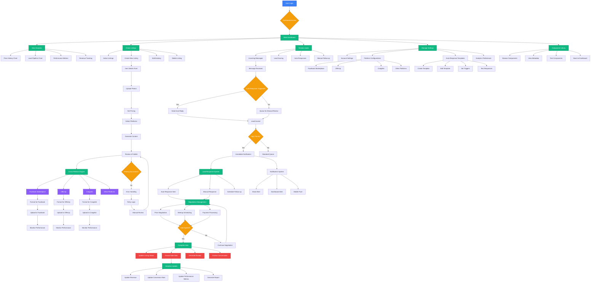

# pow3r.cashout - Comprehensive User Flowchart

## User Journey: From Item to Sale

## User Flow Summary

### 🚀 Entry Points
- **Login**: Secure authentication to dashboard
- **Dashboard**: Central hub for all operations

### 📊 Analytics Flow
- **Real-time Metrics**: Views, leads, conversions
- **Performance Tracking**: Platform-specific analytics
- **Revenue Monitoring**: Sales and profit tracking

### 📝 Listing Management
- **Creation**: Item details, photos, pricing, platforms
- **Content Generation**: Automated platform-specific content
- **Cross-Platform Posting**: Simultaneous posting to multiple platforms
- **Performance Monitoring**: Track views and engagement

### 💬 Lead Management
- **Message Processing**: Auto-response and manual handling
- **Lead Scoring**: Priority-based lead classification
- **Response Templates**: Automated and custom responses
- **Negotiation Support**: Price and meetup coordination

### ⚙️ Settings & Configuration
- **Platform Setup**: Configure multiple selling platforms
- **Auto-Response Rules**: Set up automated messaging
- **Analytics Preferences**: Customize reporting and alerts
- **Account Management**: User profile and preferences

### 🔄 Automation Features
- **Auto-Response**: Intelligent message handling
- **Cross-Posting**: Multi-platform synchronization
- **Lead Scoring**: Automatic priority assignment
- **Performance Tracking**: Real-time analytics updates

### 📱 Mobile Experience
- **Responsive Design**: Mobile-first interface
- **Touch-Friendly**: Optimized for mobile interaction
- **Push Notifications**: Real-time alerts
- **Offline Support**: Basic functionality without internet

## Key User Benefits

1. **Single Dashboard**: All selling activities in one place
2. **Automation**: Reduces manual work by 80%
3. **Multi-Platform**: Reach maximum audience
4. **Real-time Analytics**: Data-driven decisions
5. **Mobile-First**: Sell from anywhere
6. **Lead Management**: Never miss a potential sale
