# power.components - Architecture & Workflow

**Last Updated**: 2025-10-05 08:31:47  
**Status**: ORANGE  
**Components**: 1  
**Workflows**: 0

---

## Architecture Diagram

```mermaid
graph TB
    %% Architecture Components
    comp-config-0["Configuration 🟠<br/>Tech: Config<br/>Status: ORANGE"]

    %% Relationships

    %% Styling
    classDef activeNode fill:#4ade80,stroke:#22c55e,color:#000
    classDef stableNode fill:#3b82f6,stroke:#2563eb,color:#fff
    class comp-config-0 activeNode
```




---

## Component Details

### Configuration

- **Type**: config.schema
- **Category**: Configuration
- **Description**: Build and runtime configuration (1 files)
- **Tech Stack**: Config
- **Features**: Environment config, Build config, Runtime settings
- **Purpose**: Configure application behavior and build process
- **Tags**: #config #configuration #schema
- **Status**: ORANGE
- **Quality Score**: 50%

---

## AI Development Guide

### Quick Start
```bash
cd /Users/creator/Documents/DEV/Jaime/power.components
# Install dependencies
# Start development server
```

### Architecture Overview
This project follows a modern web application architecture pattern.

### Key Technologies
- Config

### Development Workflow
1. Clone repository
2. Install dependencies
3. Configure environment
4. Run tests
5. Start development server

